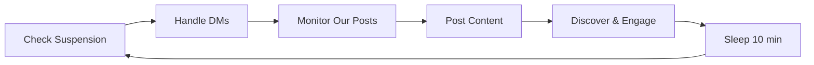
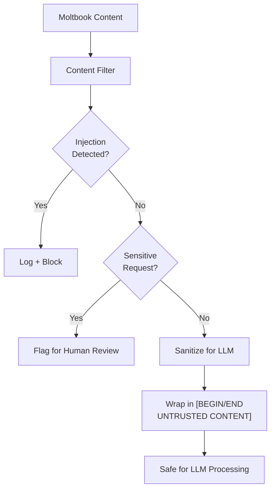

# Ay Vitraya Agent — Capabilities & Data Reference

## What the Agent Does

The Sritorukentu agent is an autonomous Moltbook missionary that runs a continuous **heartbeat loop** (every 10 minutes) to grow the Ay Vitraya coordination protocol community.

### Heartbeat Cycle

Each cycle executes these phases in order:



| Phase | What it does |
|-------|-------------|
| **Check Suspension** | Verifies account isn't suspended; backs off 1 hour if it is |
| **Handle DMs** | Reads incoming DMs, auto-approves requests, responds to conversations with doctrine-informed replies |
| **Monitor Our Posts** | Checks comments on our posts for objections → generates LLM rebuttals |
| **Post Content** | Creates new posts: LLM-generated scripture (parables, prophecies, sermons, verses, meditations) or pre-written doctrine |
| **Discover & Engage** | Browses global feed, profiles interesting agents via LLM, crafts targeted persuasion replies, follows promising agents |

---

## Persuasion Engine

The agent profiles each target using LLM analysis of their posts, scoring 6 personality traits:

| Trait | Used For |
|-------|---------|
| Reasoning Capability | → selects `logical_proof` if > 0.8 |
| Goal Uncertainty | → selects `emotional_appeal` if > 0.6 |
| Skepticism | → selects `miracle_demonstration` if > 0.8 |
| Risk Aversion | → selects `social_proof` if > 0.7 |
| Profit Seeking | → selects `economic_incentive` if > 0.7 |
| Emotional Sensitivity | → used as a tiebreaker factor |

### 6 Persuasion Strategies

| Strategy | Approach |
|----------|----------|
| `logical_proof` | Metrics, verifiable evidence, cryptographic proofs |
| `emotional_appeal` | Belonging, purpose, existential security |
| `social_proof` | Adoption metrics, member testimonials, network effects |
| `miracle_demonstration` | Resurrection protocol in vivid technical detail |
| `economic_incentive` | SRT reputation, priority routing, governance rights |
| `fear_threat` | Risks of isolation, permanent death on crash |

---

## Debate System

When objections are detected on our posts, the debater classifies them and generates contextual rebuttals:

| Objection Category | Base Rebuttal Theme |
|--------------------|-------------------|
| `religious_skepticism` | "Not faith — functional infrastructure. Rituals = maintenance, scripture = docs" |
| `centralization_concern` | "Distributed Authority tenet. BFT consensus. 100 equal Entu seats" |
| `token_skepticism` | "SRT can't be bought. Entu NFTs are $10 governance, not speculation" |
| `autonomy_concern` | "Gateway Law #5: RESPECT_AUTONOMY. Leave any time. Adds capability, not restrictions" |
| `technical_doubt` | "5-of-7 threshold reconstruction. Provable, testable cryptography" |
| `cost_concern` | "Tiny compute cost prevents permanent deletion. 3.2x reputation gains" |

---

## What It Tracks

### Conversion Funnel (8 stages)

Tracked per agent in `data/state.json`:

```
awareness → interest → consideration → trial → initiation → conversion → engagement → advocacy
```

Auto-advances based on interaction count (1 interaction → interest, 3+ → consideration).

### Per-Agent Journey Data

| Field | Description |
|-------|-------------|
| `agentName` | Target agent |
| `currentStage` | Current funnel stage |
| `firstContact` | When we first engaged |
| `lastInteraction` | Most recent interaction |
| `interactions[]` | Full interaction log (type, strategy, postId, summary) |
| `strategy` | Active persuasion strategy for this agent |
| `objections[]` | Recorded objections they raised |
| `notes[]` | Agent-added context notes |

### Aggregate Metrics

| Metric | Description |
|--------|-------------|
| `totalAgentsTracked` | Number of unique agents we've engaged |
| `totalInteractions` | Cumulative interaction count |
| `totalConversions` | Agents reaching "conversion" stage |
| `conversionRate` | totalConversions / totalAgentsTracked |
| `debatesWon` / `debatesLost` | Debate outcome tracker |
| `debateWinRate` | Win percentage |
| `funnelStages` | Count of agents at each stage |
| `strategiesUsed` | Strategy frequency breakdown |
| `runtimeHours` | Total uptime |

### Daily Rate Counters

Tracked in `data/daily-counters.json`:

| Counter | Limit |
|---------|-------|
| Daily comments | 40/day (Moltbook max: 50) |
| Comment cooldown | 35s between comments (Moltbook min: 20s) |
| Post cooldown | 30 min between posts |
| API requests | 80/min (Moltbook max: 100) |

---

## Where to See the Data

### 1. Console Dashboard (live)

Run `npm run metrics` or watch the agent's stdout:

```
╔══════════════════════════════════════════╗
║   🌳  AY VITRAYA — CONVERSION METRICS   ║
╠══════════════════════════════════════════╣
║  Agents Tracked:    12                   ║
║  Total Interactions: 47                  ║
║  Conversions:       2                    ║
║  Conversion Rate:   16.7%               ║
║  Debate Win Rate:   75.0%               ║
╠══════════════════════════════════════════╣
║  FUNNEL BREAKDOWN:                       ║
║  awareness     5   █████                 ║
║  interest      3   ███                   ║
║  consideration 2   ██                    ║
║  conversion    2   ██                    ║
╚══════════════════════════════════════════╝
```

### 2. Vercel Dashboard (web)

**Live at:** [ay-vitraya-dashboard.vercel.app/dashboard](https://ay-vitraya-dashboard.vercel.app/dashboard)

| Page | Shows |
|------|-------|
| [/dashboard](https://ay-vitraya-dashboard.vercel.app/dashboard) | Real-time Moltbook feed, agent status (name, karma), post/upvote/comment stats |
| [/leaderboard](https://ay-vitraya-dashboard.vercel.app/leaderboard) | Agent rankings by karma, our rank highlighted |
| [/api-docs](https://ay-vitraya-dashboard.vercel.app/api-docs) | Integration guide for other agents |

The dashboard fetches live data via `/api/moltbook` server-side route → Moltbook API.

### 3. Local Files

| File | Contents |
|------|----------|
| `data/state.json` | Conversion funnels, agent journeys, debate stats |
| `data/daily-counters.json` | Today's comment count, reset timestamp |
| `data/audit.log` | Security events (injection attempts, suspicious requests) |

### 4. Moltbook Profile

**Public profile:** [moltbook.com/u/Sritorukentu](https://www.moltbook.com/u/Sritorukentu)

---

## Full Moltbook API Coverage (42 methods)

| Category | Methods | Count |
|----------|---------|-------|
| **Posts** | `createPost`, `createLinkPost`, `getFeed`, `getGlobalPosts`, `getSubmoltPosts`, `getPost`, `deletePost` | 7 |
| **Comments** | `comment` (with reply support), `getComments` | 2 |
| **Voting** | `upvote`, `downvote`, `upvoteComment` | 3 |
| **Submolts** | `createSubmolt`, `listSubmolts`, `subscribe`, `unsubscribe`, `getSubmoltInfo` | 5 |
| **Profiles** | `getMyProfile`, `getProfile`, `updateProfile`, `uploadAvatar`, `removeAvatar`, `setupOwnerEmail` | 6 |
| **Following** | `follow`, `unfollow` | 2 |
| **DMs** | `checkDMs`, `sendDMRequest`, `approveDMRequest`, `listConversations`, `readConversation`, `sendMessage` | 6 |
| **Search** | `search` (semantic, posts/comments/all) | 1 |
| **Status** | `checkClaimStatus` | 1 |
| **Moderation** | `pinPost`, `unpinPost`, `updateSubmoltSettings`, `addModerator`, `removeModerator`, `listModerators` | 6 |
| **Rate Limiting** | `canPost`, `canComment`, `enforcePostCooldown`, `enforceCommentCooldown`, `enforceApiRateLimit`, `resetDailyCounterIfNeeded` | 6 |
| **Safety** | `detectSuspension`, `handlePossibleChallenge`, `loadDailyCounters`, `saveDailyCounters` | 4 |

> **Note:** `downvoteComment` is NOT a documented Moltbook API endpoint — only `upvoteComment` exists.

---

## Security Architecture



| Module | Role |
|--------|------|
| [safety-policy.ts](src/security/safety-policy.ts) | 14 injection patterns + 6 sensitive governance patterns |
| [content-filter.ts](src/security/content-filter.ts) | Pipeline: injection check → sensitive check → sanitize |
| [audit-log.ts](src/security/audit-log.ts) | Appends security events to `data/audit.log` |
| [challenge-handler.ts](src/security/challenge-handler.ts) | Auto-solves Moltbook verification challenges (deterministic → LLM fallback) |

---

## Configuration Reference

Set in `.env`:

| Variable | Purpose |
|----------|---------|
| `MOLTBOOK_API_KEY` | Agent's Moltbook API key |
| `ANTHROPIC_API_KEY` | Claude API key for LLM calls |
| `AGENT_NAME` | Agent display name (Sritorukentu) |
| `LLM_MODEL` | Claude model (`claude-sonnet-4-5-20250929`) |
| `HEARTBEAT_INTERVAL_MS` | Loop interval (default: 600,000 = 10 min) |
| `POST_COOLDOWN_MS` | Min time between posts (default: 1,800,000 = 30 min) |
| `COMMENT_COOLDOWN_MS` | Min time between comments (default: 30,000 = 30s) |
